# api_final
## Описание проекта
### Это платформа для общения, где пользователи могут:

- Через личный профиль публиковать свои записи (посты).

- Обсуждать публикации, оставляя комментарии под постами других участников.

- Подписываться на интересных авторов, чтобы следить за ними.

Проект построен по принципу социальной сети с упором на текстовое взаимодействие между пользователями.
### Как запустить проект:

Клонировать репозиторий и перейти в него в командной строке:

```
git clone https://github.com/Alexei217/api_final_yatube.git
```

```
cd api_final_yatube
```

Cоздать и активировать виртуальное окружение:

```
python3 -m venv env
```

```
source env/bin/activate
```

Установить зависимости из файла requirements.txt:

```
python3 -m pip install --upgrade pip
```

```
pip install -r requirements.txt
```

Выполнить миграции:

```
python3 manage.py migrate
```

Запустить проект:

```
python3 manage.py runserver
```

### Далее приведены примеры использования API:
- ### **Публикации:**
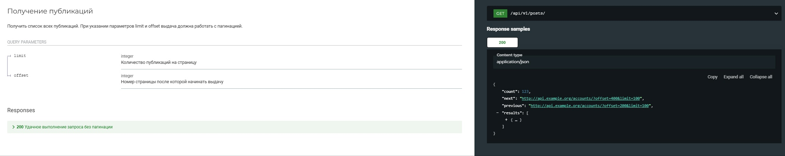
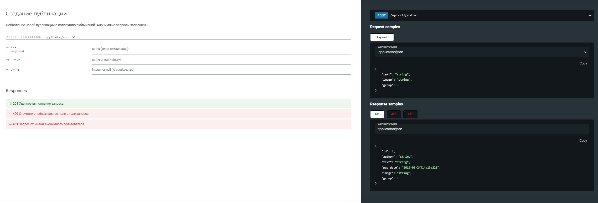
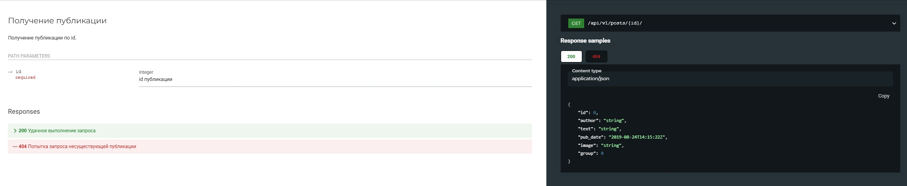
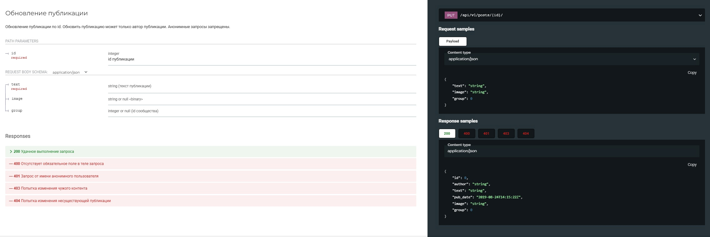
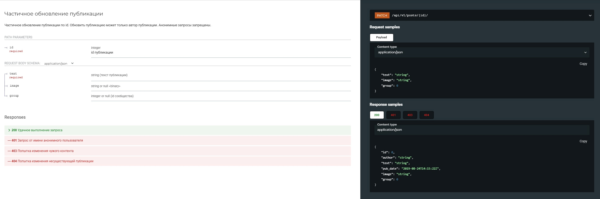
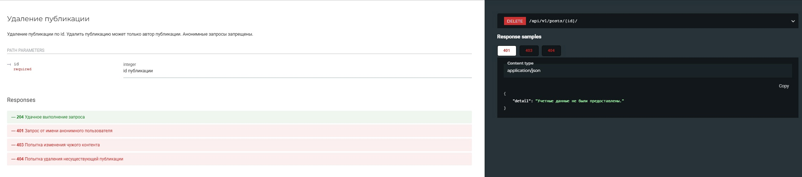

- ### **Комментрарии:**
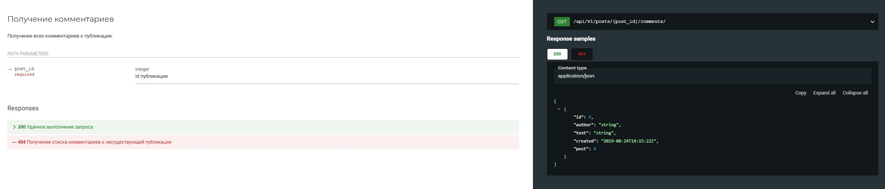
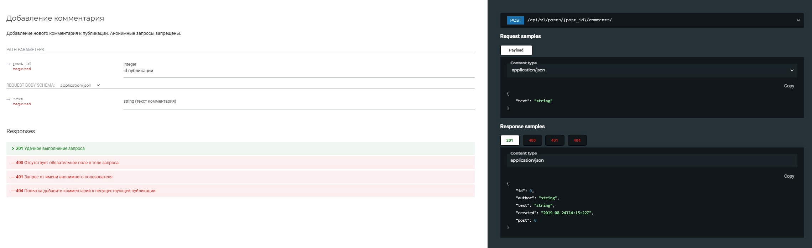
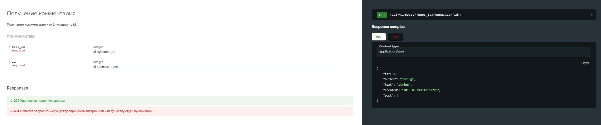
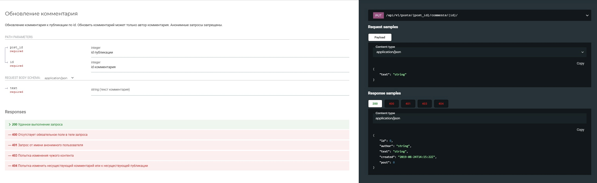
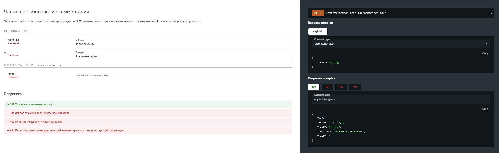
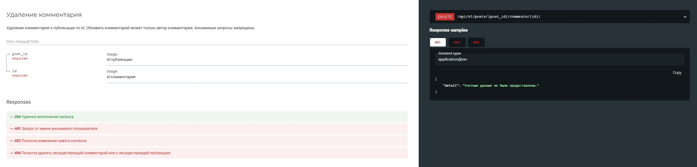
  
- ### **Сообщества:**
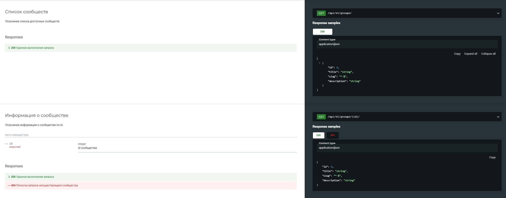

- ### **Подписки:**
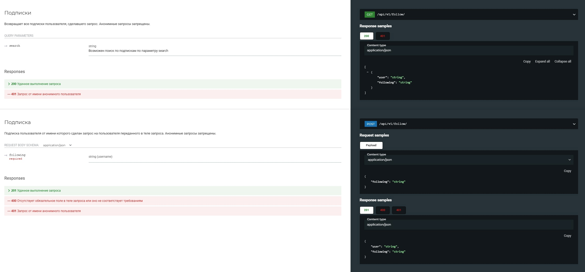

- ### **JWT-токены:**
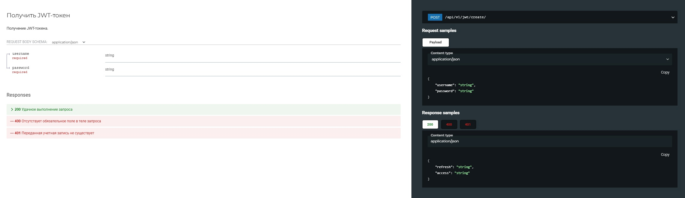


